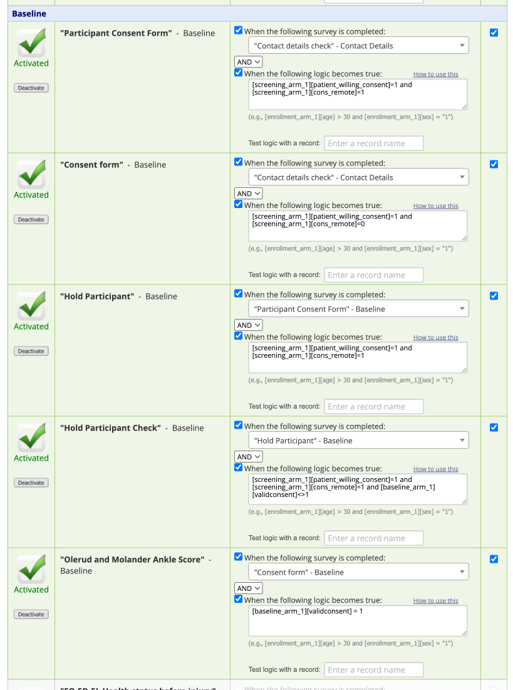
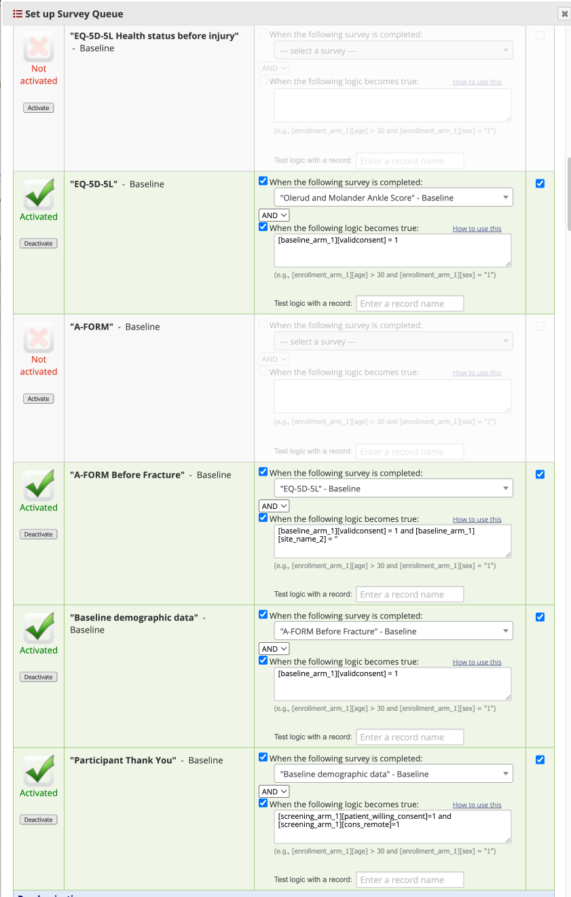
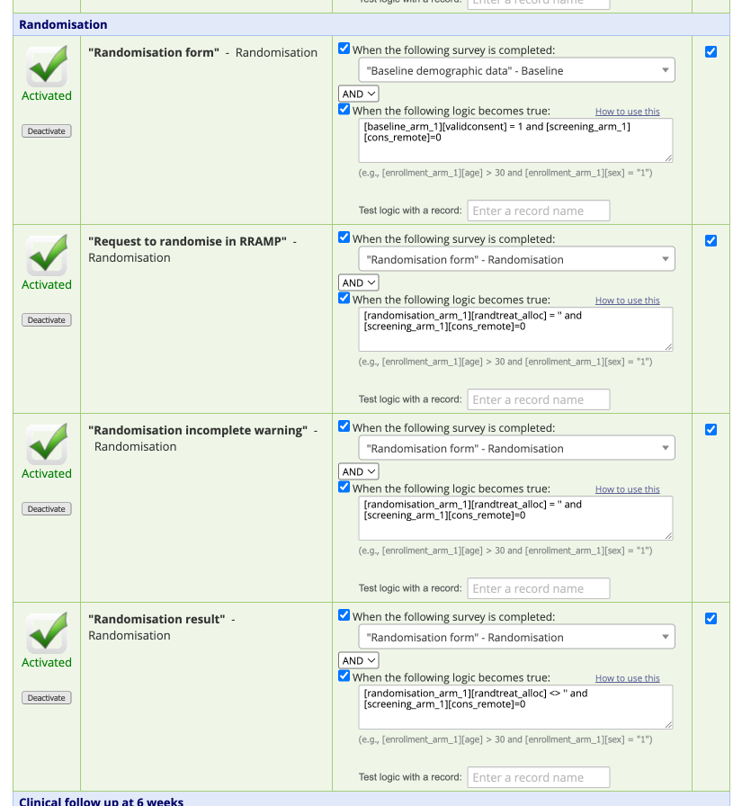
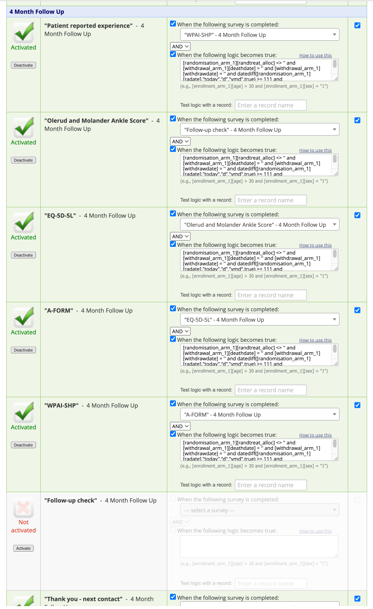
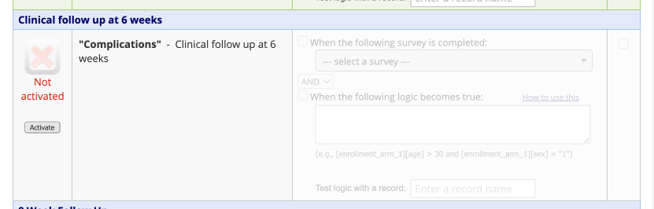
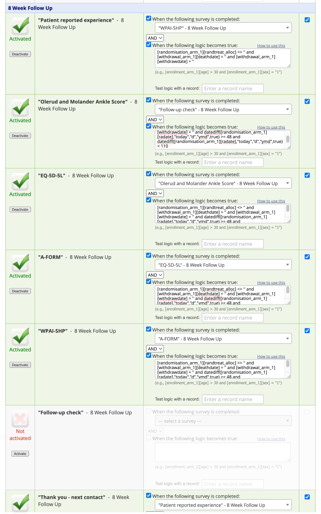
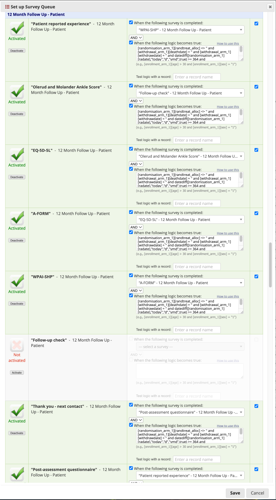

# FAME Data

1. Files

| Filename | Description                                                                                                                                                                                                                                                                                                                             |
|--|-----------------------------------------------------------------------------------------------------------------------------------------------------------------------------------------------------------------------------------------------------------------------------------------------------------------------------------------|
| FAME-FormCompletion_DATA_2025-08-04_1414.csv | REDCap CSV report containing data from all participants on when individual formas have been completed (in Survey Mode) and the completion status. *Note* If a date is missing it may be that the form was completed over the phone in survey mode, suggest that if there is a timestamp that you use that, else query the missing data. |
| FAME-Demographics_DATA_2025-08-04_1416.csv | Demographics data for randomised participants only 
| FAME_DataDictionary_2025-08-05.csv | Data dictionary to convert variable names and numeric answers to actual text |

For the data files the first row consists of headers, made up of the following columns, followed by a list of variable names.

| Header | Description |
|--------|-------------|
| record_id | This is a unique identifier that should be used to link data from different files within a study |
| redcap_event_name| This is the event or vist at which data has been collected, only data for that event are shown on that row. *Note* if a record has data over multiple events it will appear over multiple rows. |
| redcap_repeat_instrument| This is the repeat number if there are repeating events, it will be blank if there is only one instance of an event. |
| redcap_repeat_instance | This is the repeat number of a specific form if there are multiple forms with the same name at the same visit, if there is only one then this will be blank. You can ONLY have multiple events OR multiple forms, not both. |
| redcap_data-access_group| This is the site that the data is associated with, if blank then the data is not associated with a site. |

2. Data flow

*Screening* (screening_arm_1):

|Order| Form | Prerequisite| Completed by| Use in analysis|
|-----|------|-------------|-------------|----------------|
| 1 | Screening form (screening_form) | None, althugh the landing page as added partway through the study so may appear first) | Research Nurse | N |
 
*Contact Details* (contact_details_arm_1):

|Order| Form                                     | Prerequisite             | Completed by| Use in analysis|
|-----|------------------------------------------|--------------------------|-------------|----------------|
| 1 | Patient Contact Details (patient_contact_details) | Willing to be randomised | Research Nurse | N |
| 2 | Contact Details Check (contact_details_check) | Previous form completed |  Research Nurse | N |
 
*Baseline* (baseline_arm_1):

 

*Notes*: (1) All forms completed by RN; (2) Please do not include in your Analysis

*Randomisation* (randomisation_arm_1);

*Notes*: (1) All forms completed by RN; (2) Please do not include in your Analysis

*Clinical follow up at 6 weeks* (clinical_follow_up_arm_1);

*Clinical follow up at 6 weeks* (clinical_follow_up_arm_1);

*Note*: Completed by RN in Forms mode

*8 Week Follow Up* (8_week_follow_up_arm_1);

*4 Month Follow Up* (4_month_follow_up_arm_1);

First form hit is "Follow-Up Check", the OMAS (Olerud and Molander Ankle score) is the primary outcome.)

*12 Month Follow Up* (12_month_follow_up_arm_1);

First form hit is "Follow-Up Check", the OMAS (Olerud and Molander Ankle score) is the primary outcome.)

3. Follow-up Invitations/Reminders

| Order | Visit | Time point (days) | Window    | Reminders            | Primary Completion Mode |
|------|-------|-------------------|-----------|----------------------|-------------------------|
| 1.  | Screening | 0                 | +/- 0     | None                 | Survey Mode             |
| 2.  | Contact Details | 0                 | +/- 0     | None                 |  Survey Mode      |
| 3.  | Baseline  | 0                 | +/- 0     | None                 |  Survey Mode      |
| 4.  | Randomisation  | 0                 | +/- 0     | None                 |  Survey Mode      |
| 5.  | Treatment  | 0                 | +/- 0     | None                 |  Survey Mode      |
| 6.  | Clinical Follow-up at 6 Weeks | 42 | +/- 0     | None                 |  Forms Mode       |
| 7. | 8 Weeks Follow-up | 56 | -8 => +54 | 56 17:00  (Up until ) | Survey Mode |
|    |                   |    |           | 56 19:00  (Up until ) |             |
|    |                   |    |           | 58 17:00  (Up until ) |             |
|    |                   |    |           | 60 17:00  (Up until ) |             |
|    |                   |    |           | 42 17:00  (after )   |             |
|    |                   |    |           | 56 16:00  (after )   |             |
|    |                   |    |           | 56 19:00  (after )   |             |
|    |                   |    |           | 58 17:00  (after )   |             |
|    |                   |    |           | 62 17:00  (after )   |             |
|    |                   |    |           | 67 11:00  (after )   |             |
